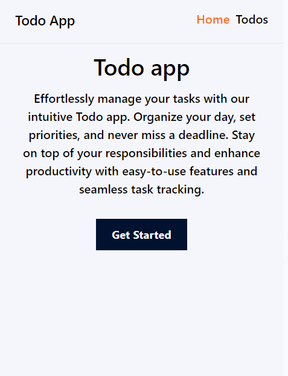
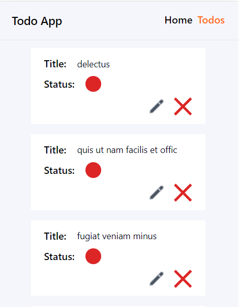
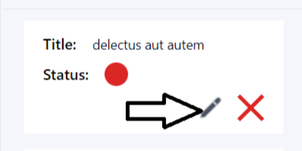
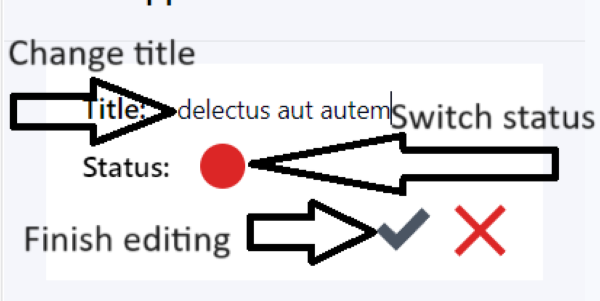
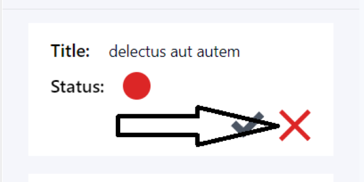
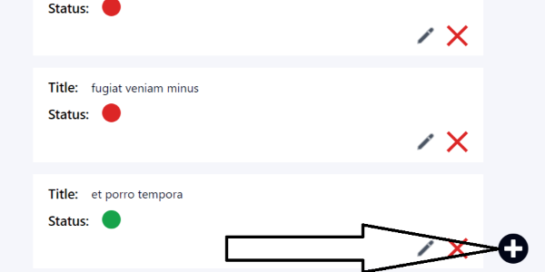
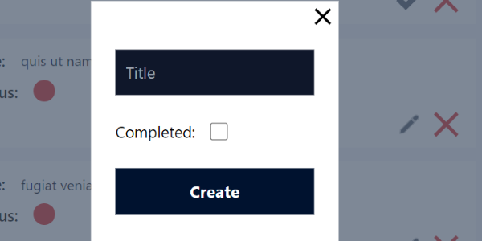
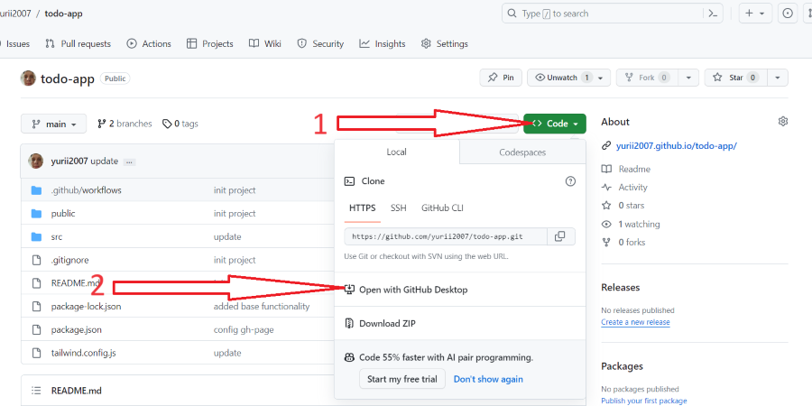
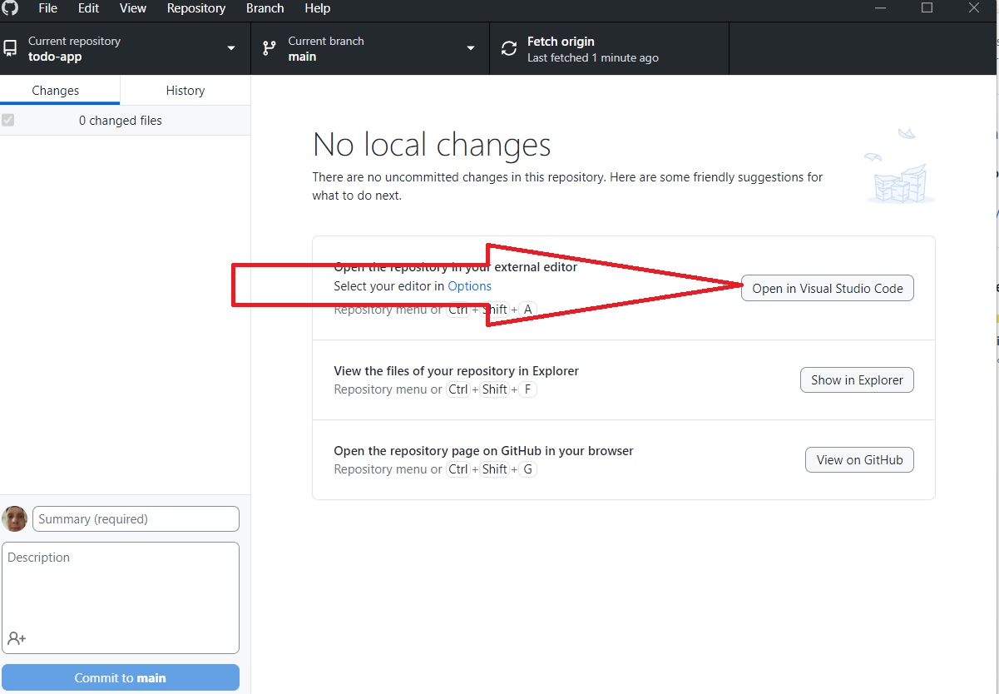
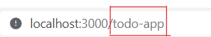

# Getting Started with Todo App

Welcome to my Todo App, where you can manage your tasks and always stay on top with your responsibilities

## Todo list

## How to edit your Todo

Press the button below:

And then you will be in editing mode, click on title to rewrite it or click on red/green circle to change the status

## How to add/delete your Todo

To delete your todo click the red button

To add Todo click the button on right bottom of the screen and enter the data of new todo

# Info for Developers

## Getting Started with Create React App

This project was bootstrapped with [Create React App](https://github.com/facebook/create-react-app).

## How to clone this repository

Click the button `<Code>`, and then click the button `Open with GitHub Desktop`, or clone repo with github cli

After GitHub Desktop opens, click the button `Open in Visual Studio Code`

And then run in your terminal one of available scripts

## Available Scripts

In the project directory, you can run:

### `npm start`

Runs the app in the development mode.\
Open [http://localhost:3000](http://localhost:3000) to view it in your browser.

Make sure that you have `/todo-app` after `localhost:3000` in your URL(for correctly work react routers)

The page will reload when you make changes.\
You may also see any lint errors in the console.

### `npm run build`

Builds the app for production to the `build` folder.\
It correctly bundles React in production mode and optimizes the build for the best performance.

The build is minified and the filenames include the hashes.\
Your app is ready to be deployed!

See the section about [deployment](https://facebook.github.io/create-react-app/docs/deployment) for more information.

### `npm run eject`

**Note: this is a one-way operation. Once you `eject`, you can't go back!**

If you aren't satisfied with the build tool and configuration choices, you can `eject` at any time. This command will remove the single build dependency from your project.

Instead, it will copy all the configuration files and the transitive dependencies (webpack, Babel, ESLint, etc) right into your project so you have full control over them. All of the commands except `eject` will still work, but they will point to the copied scripts so you can tweak them. At this point you're on your own.

You don't have to ever use `eject`. The curated feature set is suitable for small and middle deployments, and you shouldn't feel obligated to use this feature. However we understand that this tool wouldn't be useful if you couldn't customize it when you are ready for it.

## Learn More

You can learn more in the [Create React App documentation](https://facebook.github.io/create-react-app/docs/getting-started).

To learn React, check out the [React documentation](https://reactjs.org/).
